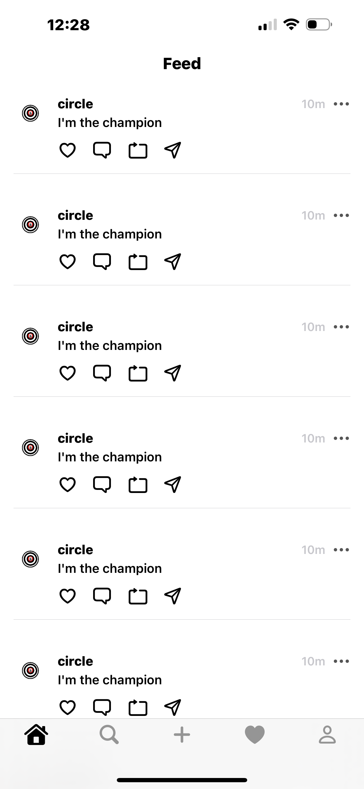
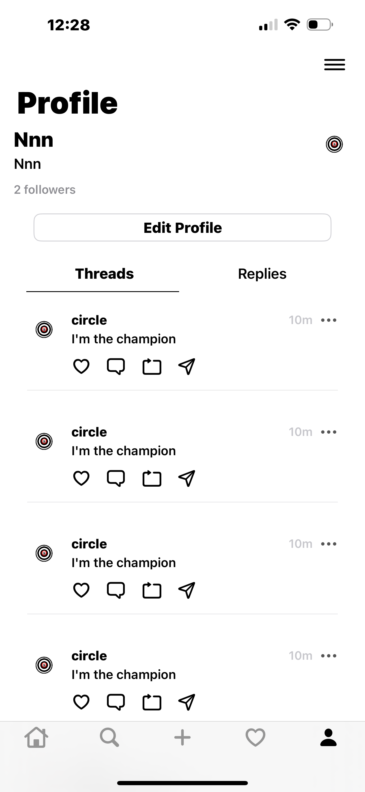

# 📱 Circle5 — Capstone Project

**Circle5** is a social-conscious SwiftUI social media app where users can only follow 5 people or groups at a time. The goal is to help people focus on meaningful relationships and reduce the digital noise that comes from unlimited following.

> “Social media should help you grow, not scroll endlessly.”

---
## ✨ App Screenshots

| Home | Explore | Edit Profile |
|------|---------|--------------|
|  |  |  |

> These are real screenshots of Circle5 running in the iOS Simulator, built entirely using SwiftUI.

## 🚀 Features

- 🔐 **User Authentication** (Firebase Auth)
- 👤 **Custom Profile View**
- ✏️ **Edit Profile** with bio, link, private toggle, and profile picture (PhotosPicker)
- 🔍 **Explore Tab** with searchable user list
- 🧵 **Thread Filter Tabs** (custom filter UI)
- 💬 **Navigation to Profiles** using `NavigationStack` and `NavigationDestination`

---

## 🧰 Built With

- **SwiftUI**
- **Firebase (Auth, Firestore)**
- **FirebaseFirestoreSwift**
- **PhotosUI** (for profile image picker)
- **MVVM Architecture**
- **Custom ViewModifiers**
- **MatchedGeometryEffect** for animated filters
- **EnvironmentObject**, **StateObject**, and clean ViewModel separation

---

## 🧠 Challenges I Faced

- 🌀 **Xcode Previews constantly crashing** when using `EnvironmentObject` or Firebase-dependent views
- ⚙️ **Git and GitHub syncing errors**, especially from iCloud and OneDrive stored files
- 🧵 **MatchedGeometryEffect** caused compiler type-check errors in long SwiftUI views
- 🔄 **Firebase import issues** like `FirebaseFirestoreSwift` not found — fixed by using Package Manager properly
- ⚠️ Multiple file paths & duplicate files during project restructuring confused Xcode's indexer

---

## 📂 Folder Structure

```plaintext
Circle5/
├── Core/
│   ├── Profile/
│   │   ├── View/
│   │   ├── ViewModel/
│   │   ├── EditProfile/
│   ├── Root/
│   ├── TabBar/
├── Model/
├── Services/
├── Utilities/
├── Extensions/
## 🔮 What's Next?

Planned Features & Improvements for Future Versions:

- 💬 **Comments** — Add replies to threads and profile activity
- 🔔 **Push Notifications** — For new followers and comments
- 🛠 **Settings Page** — Change theme, privacy, and preferences
- 🤝 **Invite-Only Mode** — For building a close beta community
- 🎨 **More UI Polishing** — Animations, transitions, accessibility improvements

---

> ✅ Feel free to star ⭐ this repo or follow my journey as I continue building Circle5!
